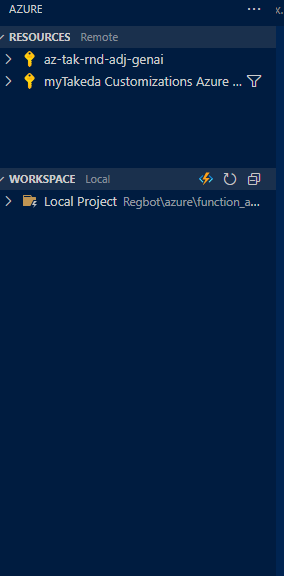

# Regbot
Resource of Regbot

# Setup local environment

1. make sure that python has been already installed on your local
2. clone this repository
3. move to "/azure/function_apps" directory
4. run `ptrhon -m venv venv`
5. run `.\venv\Scripts\activate`
6. run `pip install -r requirements.txt`

# How to deploy

1. install vscode extensions related to Azure resource and functions
2. make sure your sidebar like following picture
3. hover your mouse on "Local Project" and click cloud icon
4. select "az-tak-rnd-adj-genai" --> "extractFileInfo"
5. click "yes" on the dialog
6. make sure that Azure console on vscode says that Deploy to App "extractfileinfo" Succeeded (it may take few minutes)
7. make sure that source code on Azure Portal is updated to the latest one (it may take less than 10 minutes)