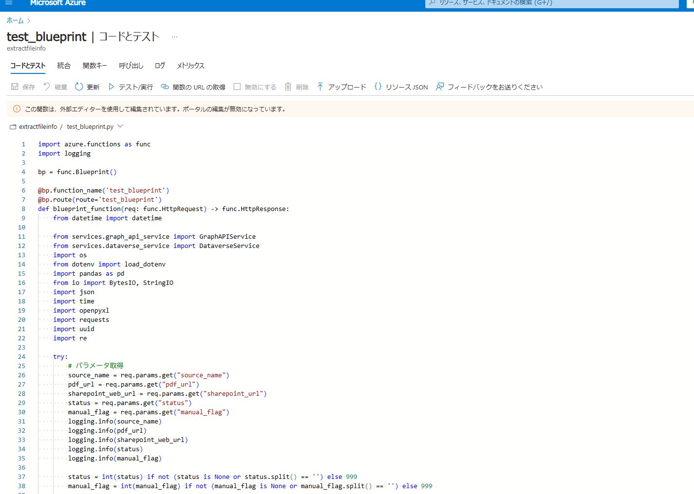
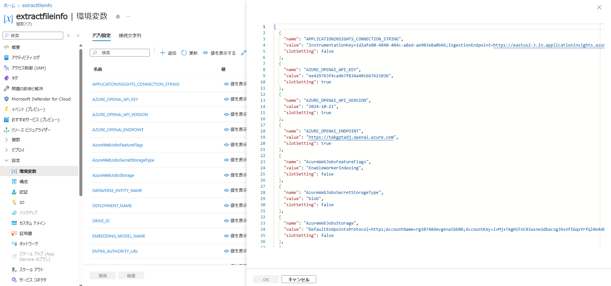

# Regbot
Resource of Regbot

# Setup local environment

1. make sure that python has been already installed on your local
2. clone this repository
3. move to "/azure/function_apps" directory
4. run `ptrhon -m venv venv`
5. run `.\venv\Scripts\activate`
6. run `pip install -r requirements.txt`

# How to deploy function apps

## Prerequisite

1. install vscode extensions related to Azure resource and functions (Azure Functions and Azure Resources must be installed at least.)
2. make sure your sidebar like following picture

## deploy

### source code deploy

1. hover your mouse on "Local Project" and click cloud icon
2. select "az-tak-rnd-adj-genai" --> {target function name}
3. click "yes" on the dialog
4. make sure that Azure console on vscode says that Deploy to App {target function name} ; such as "extractfileinfo";  Succeeded (it may take few minutes)
5. make sure that source code on Azure Portal is updated to the latest one (it may take less than 10 minutes)

### prepare local.settings.json

local.settings.json is necessary to update environment variables on function app from local environment.  
CAUTION: The content of local.settings.json must be different in dev/test/prd environment.

1. Create or open local.settings.json on "function_apps" directory.
2. Show the current env variables on FunctionApps portal screen of appropriate env (portal screen must be like following picture)
3. Copy the contents and paste them into the local.settings.json file.

### update environment variables on function app

1. update local.settings.json with appropriate environment variables
2. click "Upload Local Settings" on target function apps like following picture
3. make sure that env variable on Azure Portal is updated to the latest one